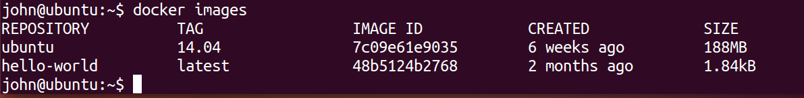
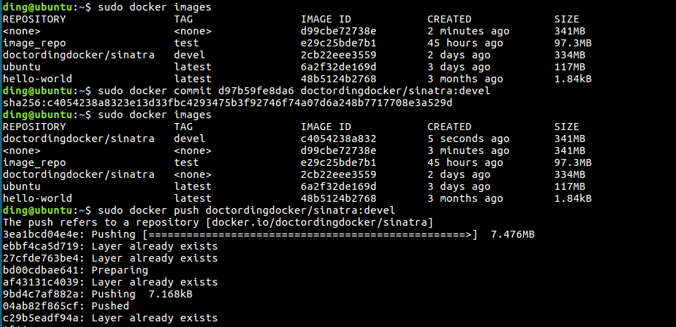
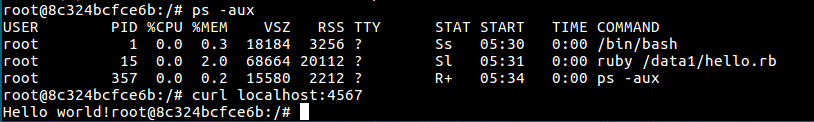

# ubuntu 安装docker和简单实用

* 安装教程（自行google/baidu)

https://github.com/doctording/chinese_docker/blob/master/installation/ubuntu.md

```
Usage: service docker {start|stop|restart|status}
```

* 注册docker账号

https://cloud.docker.com


## hello world运行


## 使用镜像，在容器中运行
```
$docker run ubuntu:14.04 /bin/echo 'Hello world'
```


## 交互式的docker

```
$docker run -t -i ubuntu:14.04 /bin/bash
```

-t 表示在新容器内指定一个伪终端或终端，
-i 表示允许我们对容器内的 (STDIN) 进行交互。

```
john@ubuntu:~$ docker run -t -i ubuntu:14.04 /bin/bash
root@d424469ea86a:/# pwd
/
root@d424469ea86a:/# ls
bin   dev  home  lib64  mnt  proc  run   srv  tmp  var
boot  etc  lib   media  opt  root  sbin  sys  usr
root@d424469ea86a:/# exit
exit
```


---

## 守护进程

* 构建容器

```
$docker run -d ubuntu:14.04 /bin/sh -c "while true; do echo hello world; sleep 1; done"
```
-d 标识告诉 docker 在容器内以后台进程模式运行。


这个长的字符串叫做容器ID（container ID）。它对于每一个容器来说都是唯一的，所以我们可以使用它.

当命令运行之后，容器的状态随之改变并且被系统自动分配了名称 
modest_sammet

* 查看容器的标准输出

```
$docker logs modest_sammet
hello world
hello world
hello world
. . .
```
docker logs 命令会查看容器内的标准输出：这个例子里输出的是我们的命令 hello world

* 停止运行的容器
docker stop 命令会通知 Docker 停止正在运行的容器。如果它成功了，它将返回刚刚停止的容器名称。


---

# 镜像

Docker运行容器前需要本地存在对应的镜像，如果镜像不存在本地，Docker会尝试先从默认的镜像仓库下载（hub.docker.com）,用户也可以配置，使用自定义的镜像仓库。

## 管理和使用本地 Docker 主机镜像。

### 1 在主机上列出镜像列表($docker images)



* 来自什么镜像源，例如 ubuntu
* 每个镜像都有标签(tags)，例如 14.04
* 每个镜像都有镜像ID

### 2 获取一个新的镜像($docker pull)

```
$ sudo docker pull centos
Pulling repository centos
b7de3133ff98: Pulling dependent layers
5cc9e91966f7: Pulling fs layer
511136ea3c5a: Download complete
ef52fb1fe610: Download complete
. . .
```

### 3 查找镜像($docker search)


## 创建基本镜像

* 手动新建Dockerfile,并创建一个镜像
```
$ mkdir sinatra
$ cd sinatra
$ touch Dockerfile
```
Dockerfile内容如下
```
# This is a comment
FROM ubuntu:14.04
MAINTAINER Kate Smith <ksmith@example.com>
RUN apt-get update && apt-get install -y ruby ruby-dev
RUN gem install sinatra
```
* $docker build 新建
```
docker build -t doctording/sinatra:label_1 .
```
使用 docker build 命令并指定 -t 标识(flag)来标示属于 doctording ，镜像名称为 sinatra,标签是 label_1
. 当前目录


## 上传 Docker 镜像到 Docker Hub Registry

### 在提交更改和构建之后为镜像来添加标签($docker tag)

```
docker tag 2cb22eee3559 doctordingdocker/sinatra:devel
```

### 显示创建的镜像

```
docker images doctordingdocker/sinatra:devel
```

### push 到 hub.docker.com

* 首先需要docker login 认证
```
$docker login
```
输入自己注册的用户名，密码即可

* docker push
```
docker push doctordingdocker/sinatra
```


### 下载自己的镜像，检测运行（$docker pull）


```
ding@ubuntu:~$ sudo docker pull doctordingdocker/sinatra:devel
devel: Pulling from doctordingdocker/sinatra
d24bc6f195c3: Pulling fs layer 
a994fca0b2a3: Download complete 
958046a70c9d: Download complete 
0e4fa347e95d: Download complete 
2f0af262ade7: Download complete 
b279d3f7b9c5: Download complete 
91efd5ef1463: Download complete 
```


---

# 容器

**对docker容器和镜像的区别理解？**

参考如下网址讲解（初学，我也不理解，有个印象）

http://blog.csdn.net/chszs/article/details/48252799

http://www.csdn.net/article/2015-08-21/2825511

## 创建

* 新建容器（处于stopped状态下），然后运行它

* 基于镜像新建一个容器并启动

```
ding@ubuntu:~$ sudo docker create -it ubuntu:latest
Unable to find image 'ubuntu:latest' locally
latest: Pulling from library/ubuntu
c62795f78da9: Pull complete 
d4fceeeb758e: Pull complete 
5c9125a401ae: Pull complete 
0062f774e994: Pull complete 
6b33fd031fac: Pull complete 
Digest: sha256:c2bbf50d276508d73dd865cda7b4ee9b5243f2648647d21e3a471dd3cc4209a0
Status: Downloaded newer image for ubuntu:latest
53feceb3fe820943ba0a10284a37af3fde030846c6075c61cc56be313161605d
ding@ubuntu:~$ sudo docker images
REPOSITORY          TAG                 IMAGE ID            CREATED             SIZE
ubuntu              latest              6a2f32de169d        29 hours ago        117MB
hello-world         latest              48b5124b2768        3 months ago        1.84kB
ding@ubuntu:~$ sudo docker run ubuntu /bin/echo 'hello docker'
hello docker
ding@ubuntu:~$
```

* $docker ps(显示容器)


## 终止容器($docker stop), 开始 start, 重启 restart

* 启动已被停止的容器myrunoob
```
docker start myrunoob
```
* 停止运行中的容器myrunoob
```
docker stop myrunoob
```
* 重启容器myrunoob
```
docker restart myrunoob
```
## 进入容器
在使用-d参数时，容器启动后会进入后台，用户无法看到容器中的信息。某些时候如果需要进入容器进行操作，有多种方法，包括使用docker attach命令，docker exec命令，以及nsenter工具等。

* docker attach命令 


* docker exec


## 删除容器($docker rm)


## 导入和导出容器($docker import/export)


### 提交对容器的修改($docker commit)

```
ding@ubuntu:~$ sudo docker ps -l
CONTAINER ID        IMAGE                            COMMAND                  CREATED             STATUS              PORTS               NAMES
d97b59fe8da6        doctordingdocker/sinatra:devel   "ruby /data1/hello.rb"   About an hour ago   Up 8 minutes                            myweb
ding@ubuntu:~$ sudo docker commit d97b59fe8da6
sha256:d99cbe72738eb36c0ae6f69ee3c21003316781d8e8fa8ff4df9ee25dc19ca00e
ding@ubuntu:~$ 
```



# 数据卷

Volumn(卷):将物理机的文件夹挂载到容器内部

* 数据卷可以在容器之间共享和重用
* 对数据卷的修改会立马生效
* 对数据卷的更新，不会影响镜像
* 卷会一直存在，直到没有容器使用

数据卷的使用，类似于linux下对目录或文件进行mount操作。

## 创建数据卷

参考：http://www.cnblogs.com/liuyansheng/p/6097710.html

容器管理实验中我们学习的命令 docker run 用来创建容器，可以在使用改命令时添加 -v 参数，就可以创建并挂载一个到多个数据卷到当前运行的容器中，-v的作用是将宿主机的一个目录作为容器的数据卷挂载到容器中，使宿主机和容器之间可以共享一个目录，如果本地路径不存在，Docker也会自动创建。


* 分别将两个目录挂载到新创建的容器上

/tmp/data1, /tmo/data2是本地宿主机目录

/data1, /data2 是新创建容器的目录，是挂载目录

```
ding@ubuntu:/tmp$ sudo docker run -t -i --name shiyanlou -v /tmp/data1:/data1 -v /tmp/data2:/data2 ubuntu /bin/bash
root@70fabbea4a95:/# ls
bin  boot  data1  data2  dev  etc  home  lib  lib64  media  mnt  opt  proc  root  run  sbin  srv  sys  tmp  usr  var
root@70fabbea4a95:/# 
```

* 查看容器数据卷信息

```
$sudo docker inspect shiyanlou
```
可以找到如下的信息
```
 "Mounts": [
            {
                "Type": "bind",
                "Source": "/tmp/data1",
                "Destination": "/data1",
                "Mode": "",
                "RW": true,
                "Propagation": ""
            },
            {
                "Type": "bind",
                "Source": "/tmp/data2",
                "Destination": "/data2",
                "Mode": "",
                "RW": true,
                "Propagation": ""
            }
        ],

```

* 数据卷中的数据在宿主机和容器共享

在容器中往数据卷中写入文件
```
root@70fabbea4a95:/# touch data1/file01
root@70fabbea4a95:/# ls -l data*
data1:
total 0
-rw-r--r-- 1 root root 0 Apr 15 00:59 file01

data2:
total 0
root@70fabbea4a95:/#
```

然后查看宿主机
```
ding@ubuntu:/tmp$ ls -l data*
data1:
total 0

data2:
total 0
ding@ubuntu:/tmp$ ls -l data*
data1:
total 0
-rw-r--r-- 1 root root 0 Apr 14 17:59 file01

data2:
total 0
ding@ubuntu:/tmp$ 
```


## 数据卷容器

在其他容器中使用 --volumes-from 来挂载某个容器中的数据卷

如下，新建一个db1容器，使用shiyanlou容器的数据卷，可以看到db1容器也有了data1,data2两个目录
```
ding@ubuntu:/tmp$ sudo docker run -t -i --volumes-from shiyanlou --name db1 ubuntu
[sudo] password for ding: 
root@38d22ec0d2a7:/# ls
bin  boot  data1  data2  dev  etc  home  lib  lib64  media  mnt  opt  proc  root  run  sbin  srv  sys  tmp  usr  var
root@38d22ec0d2a7:/# 
```


## 数据库迁移

* 备份db1容器的/data1下面的内容，到宿主机的 /tmp/backup目录下

创建worker容器 运行后直接tar命令，完成备份操作

```
ding@ubuntu:/tmp$ sudo docker run --volumes-from db1 -v /tmp/backup:/backup --name worker ubuntu tar cvf /backup/backup.tar /data1
tar: Removing leading `/' from member names
/data1/
/data1/file01
ding@ubuntu:/tmp$
```

* 参看结果


---

# docker 简单web应用和网络配置

**首先容器有自己的内部网络和IP地址（$docker inspect containerId）**

---

## 用自己的容器写一个简单的web

```
sudo docker run -d -P --volumes-from container_my --name myweb doctordingdocker/sinatra:devel ruby /data1/hello.rb
```

```
ding@ubuntu:~$ sudo docker ps -a
[sudo] password for ding: 
CONTAINER ID        IMAGE                            COMMAND                  CREATED             STATUS                    PORTS               NAMES
d97b59fe8da6        doctordingdocker/sinatra:devel   "ruby /data1/hello.rb"   4 minutes ago       Up 4 minutes                                  myweb
8c324bcfce6b        doctordingdocker/sinatra:devel   "/bin/bash"              2 hours ago         Up 17 minutes                                 container_my
```




**只能用localhost(127.0.0.1):port在容器中访问到，不能在宿主机中访问到** 


## 利用training/webapp，启动一个web服务

```
$sudo docker run -d -P training/webapp python app.py
```

-d 标识是让 docker 容器在后台运行。

-P 标识通知 Docker 将容器内部使用的网络端口映射到我们使用的主机上(随机映射一个端口)


-p（小写字母） 则可以指定要映射的端口，在一个端口上只可以绑定一个容器
* ip:hostPort:containerPort
* ip::containerPort
* hostPort:containerPort


宿主机的32777端口映射到了容器的5000端口

* 宿主机访问容器的web应用


* $docker log 查看容器应用信息


---
